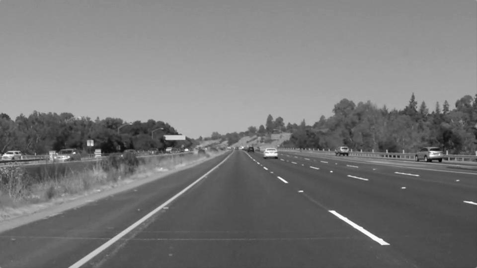

# **Finding Lane Lines on the Road** 

The goals / steps of this project are the following:
* Make a pipeline that finds lane lines on the road
* Reflect on your work in a written report

---

### Reflection

### 1. Describe your pipeline. As part of the description, explain how you modified the draw_lines() function.

1. Convert image to grayscale

2. Apply Gaussian blur to the image
3. Apply Canny Edge Detection

4. Select only the part of the image containing the lane lines by applying a mask to the
region of interest. The rest of the image will be black.

5. Run hough line detection to produce a list of lines in the region of interest.
7. The `draw_lines()` method was modified to do the following:
    * Take the list of lines and group into lines for the left and right lane lines. This is done by checking if the slope is positive or negative.
    * Filter out outlier lines. This is done by first ignoring lines that are mostly horizonal and do meet the threshold slope. Next, the slopes and y-intercepts of each line are calculated and a gaussian distrubition is applied to only accept lines with +-1.5 standard deviations of the mean.
    * An average slope and y-intercept is calculated for the cleaned left and right line sets. One line is drawn for each lane line from the top to bottom of the region of interest.
8. The lane lines are transparently overlayed on top of the original image.

### 2. Identify potential shortcomings with your current pipeline
This is a minimal implementation of a lane finding pipeline. It works as a proof of concept, but 
is missing features necessary to work in a production context. This pipeline detects lanes as straight lines, which works fine for a relatively straight road. However, this could be insufficient for roads with a tight turn radius. This pipeline also uses hardcoded parameters that were tuned with daylight images. This would likely not work at night or with inclement weather. There can also sections of road where markings can be worn, or missing, which the pipeline doesn't account for.

An autonomous vehicle would likely need to detect other others of lines on the road, too, like cross walks. Additionally logic would be needed to account for roads with multiple lanes, like highways.

### 3. Suggest possible improvements to your pipeline
The Canny Edge detection works by classifying edges where there is a significant change in the image. This can be thrown off when the conditions of the image change, such as lighting conditions. There are a few techniques which could help mitigate this: \
* Add an additional step to the pipeline with HSV filtering to select only yellow and white (road lines) parts of the image.
* Preserve some historical data in the pipline so it is more resistant to anomalies in a single frame.

Instead of modelling the lanes as straight lines, they could be modelled as polynomials or curves to better work with winding roads.